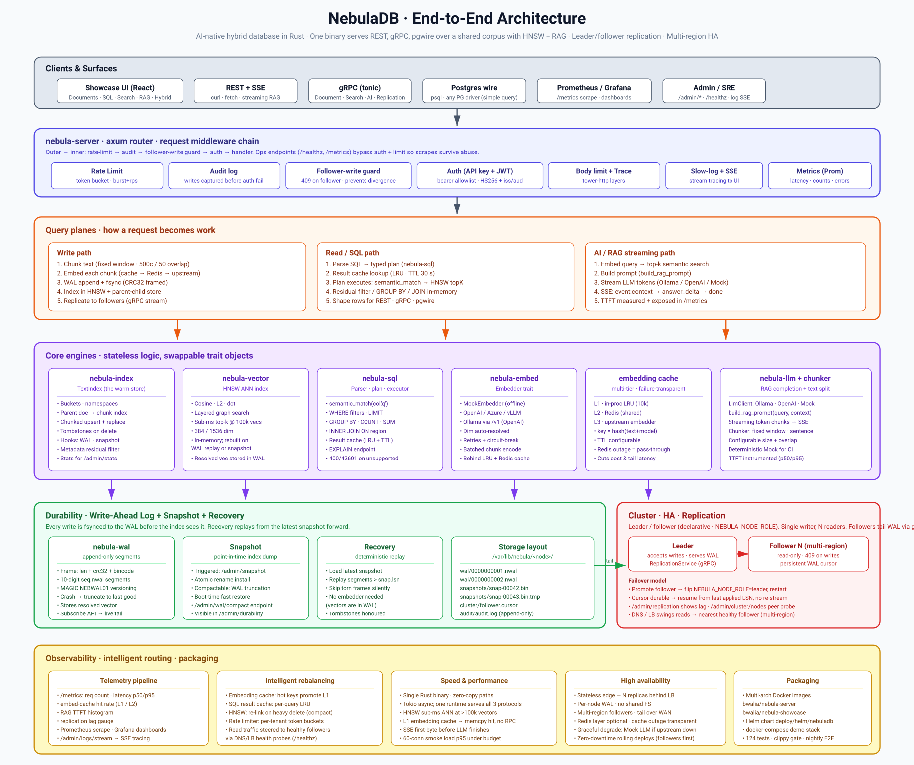

# nebuladb (Helm chart)

Single chart that deploys NebulaDB + the showcase admin UI on
Kubernetes. Optional Redis subchart for the second-tier embedding
cache.



For the full system view (clients, edge middleware, query planes,
core engines, durability, replication, HA), see the
[architecture diagram](../../../docs/architecture.svg) in the repo
root `docs/` directory.

## Install

```bash
# From a local checkout:
helm dependency update deploy/helm/nebuladb
helm install nebula deploy/helm/nebuladb

# With Redis bundled:
helm install nebula deploy/helm/nebuladb --set redis.enabled=true

# Pointing at an external Redis:
helm install nebula deploy/helm/nebuladb \
  --set externalRedisUrl=redis://prod-redis:6379

# Production-shaped deploy:
helm install nebula deploy/helm/nebuladb -f my-values.yaml
```

## Upgrade

```bash
helm upgrade nebula deploy/helm/nebuladb -f my-values.yaml
```

Note the Deployment uses `Recreate` strategy — one Pod at a time.
NebulaDB is currently in-memory single-node; rolling alongside a
second writer would split state. Once snapshot-and-restore ships,
the strategy flips to `RollingUpdate`.

## Key values

| Path | Default | Purpose |
|---|---|---|
| `server.image.repository` | `bwalia/nebula-server` | Docker Hub repo |
| `server.image.tag` | `latest` | Image tag — pin in production |
| `server.replicaCount` | `1` | Currently must stay 1 (see above) |
| `server.env.*` | various | Mirrors every `NEBULA_*` env var |
| `server.secretEnv` | `{}` | Map env-var → Secret name for JWT / API keys |
| `server.ingress.enabled` | `false` | Set true to expose REST |
| `server.persistence.enabled` | `false` | Reserved for future snapshot feature |
| `redis.enabled` | `false` | Bundle Bitnami Redis |
| `externalRedisUrl` | `""` | Point at external Redis |
| `showcase.enabled` | `true` | Deploy the React admin UI |
| `serviceMonitor.enabled` | `false` | kube-prometheus-stack scrape target |

See `values.yaml` for the full list with inline comments.

## Secrets

Don't put API keys in `values.yaml`. Create a Kubernetes Secret and
reference it:

```yaml
# my-values.yaml
server:
  secretEnv:
    NEBULA_API_KEYS: nebula-api-keys
    NEBULA_JWT_SECRET: nebula-jwt
```

```bash
kubectl create secret generic nebula-api-keys \
  --from-literal=NEBULA_API_KEYS=my-first-key,my-second-key

kubectl create secret generic nebula-jwt \
  --from-literal=NEBULA_JWT_SECRET="$(openssl rand -hex 32)"
```

The chart wires these via `envFrom: secretRef`, so every key in the
Secret becomes an env var on the Pod.

## Uninstall

```bash
helm uninstall nebula
# If persistence is enabled, PVCs stay behind. Remove explicitly:
kubectl delete pvc -l app.kubernetes.io/instance=nebula
```
